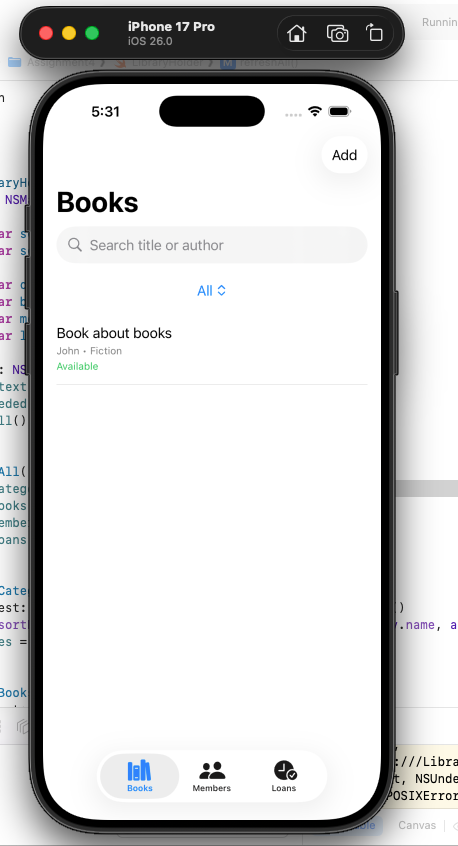
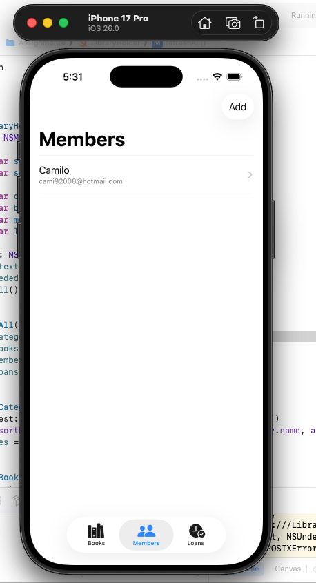
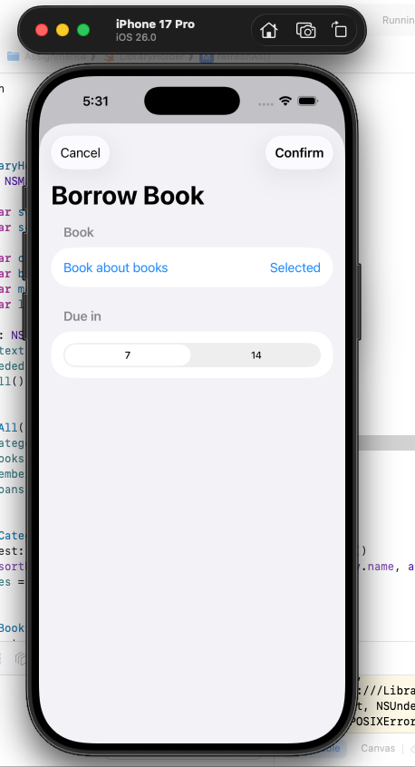
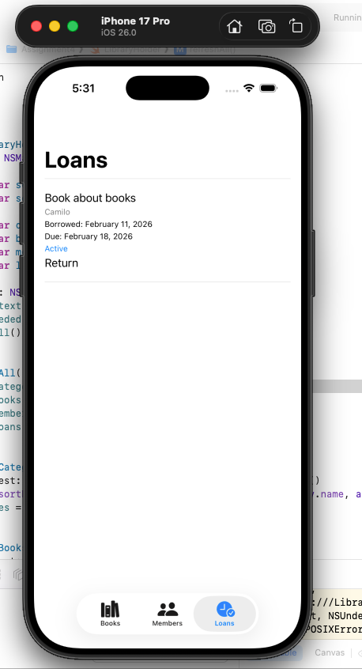

Program is initialized with 3 categories, no books, no member and no loans.

It is necessary to have members and books in order to create a loan.

After creating a loan in the Loans section you can click on the desired loan to mark the book as returned.

